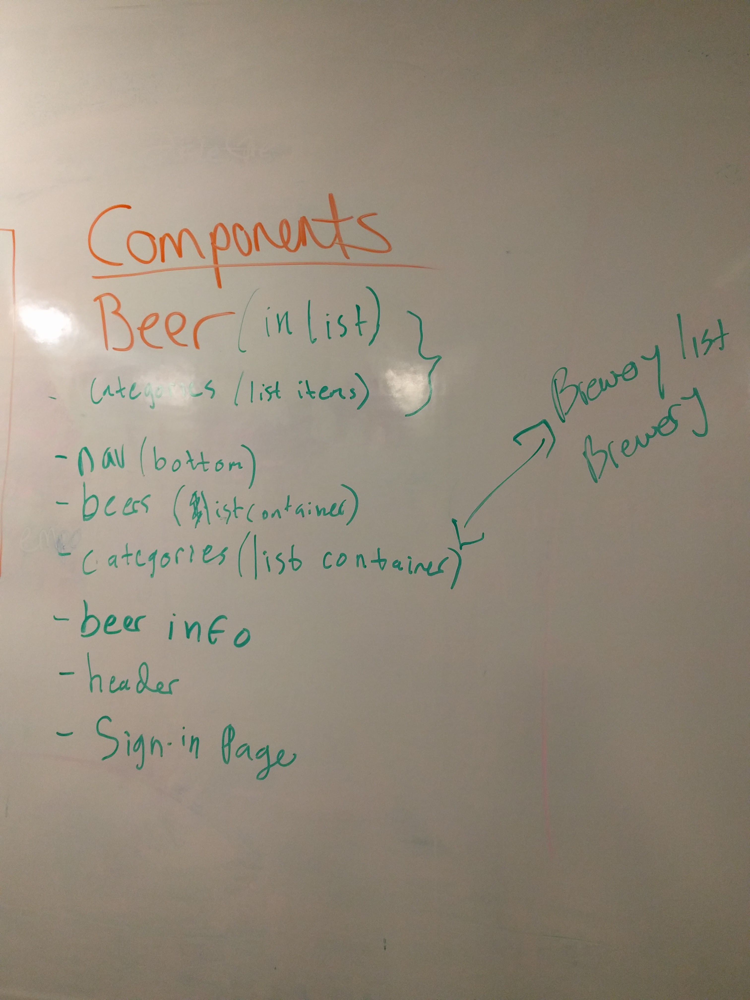
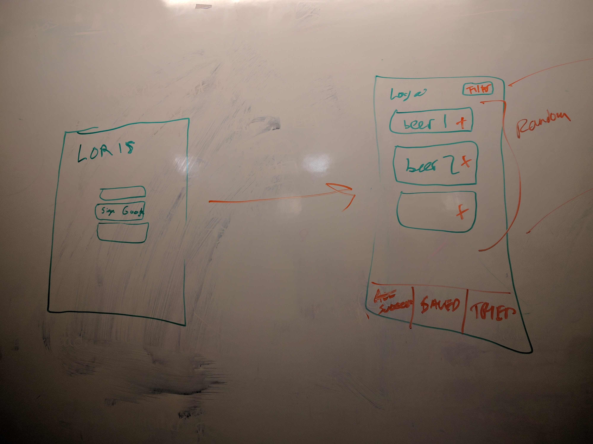
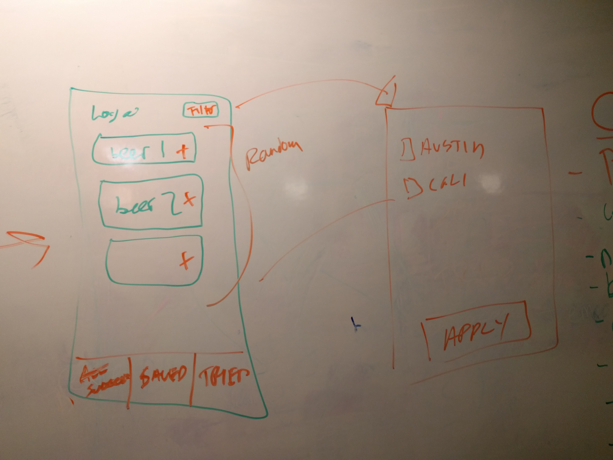
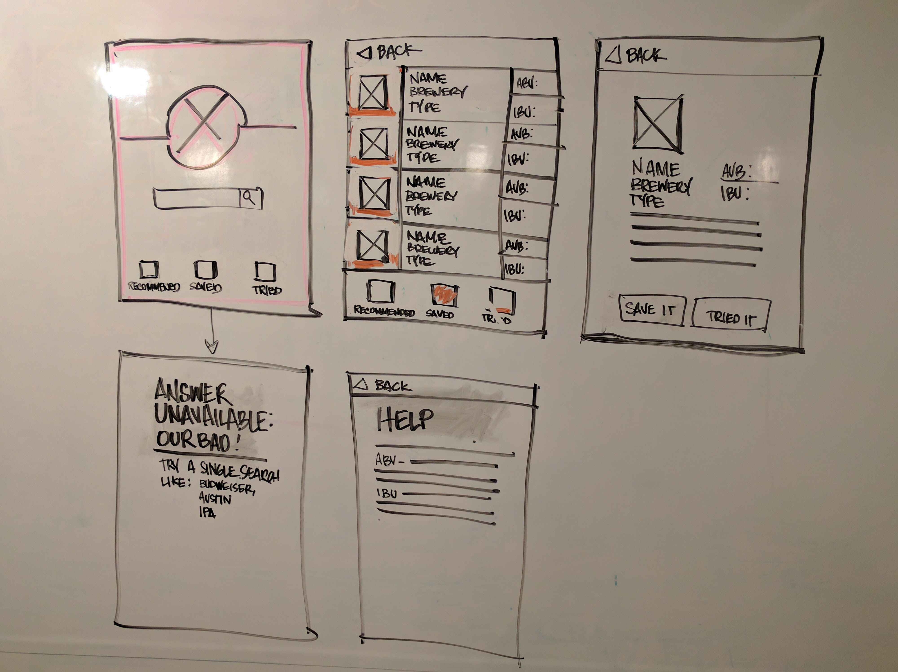
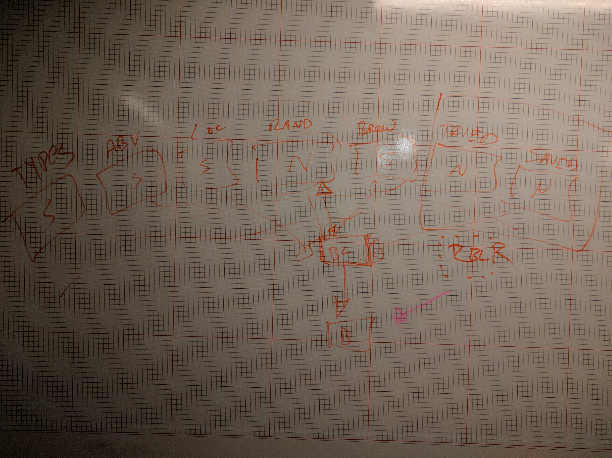

# **Technologies Used:**
React Native, Realm

# **Approach to project:**
Think of app idea, make app....We used our wireframe as a solid foundation to our project and built on it as we went.

We didn't shy away from using as many components as possible and worked very well as a team of developers and

designers to build a functioning app that provides an informational and user friendly experience.

# **Unsolved problems:**
more than one brewery on location

# **User stories:**
* For the beer lover who is in a different city and wants to know what local beer is available
* When a beer is selected, information that includes the beers name, type, ABV, IBU, and a description
* User is able to place a selected beer into a saved list to try out later
* User can place beers they have tried into a tasted section

# **Wireframe:**

# **Future goals:**
* Include search near me,
* Delete from list option,
* Leave review and rating for tasted beers,
* Animations for landing screen background,
* Beer of the day
